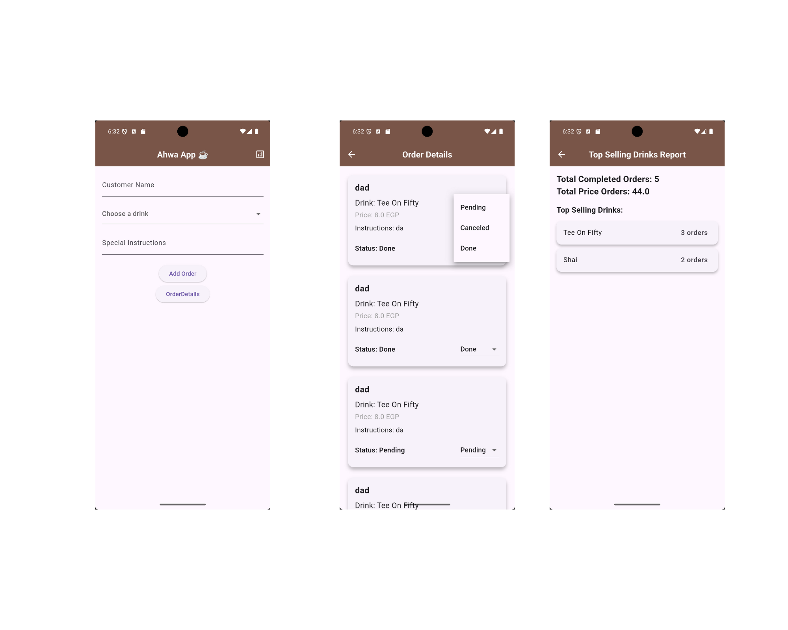

# ☕ Smart Ahwa Manager

A Flutter application designed to help café (ahwa) owners in Cairo streamline their daily operations.
The app allows you to manage customer orders, track pending/completed orders, and generate sales reports to see top-selling drinks and total revenue.

---

## 🚀 Features

* Add new orders with:

  * Customer name
  * Drink type (Shai, Turkish Coffee, Hibiscus Tea, etc.)
  * Special instructions (e.g., "extra mint, ya rais")
* Track orders with different states: **Pending, Done, Canceled, Refunded**
* View pending orders in a dashboard
* Mark orders as completed or canceled
* Generate reports:

  * Total orders served
  * Top-selling drinks
  * Total sales

---

## 📸 Screenshots

### 🏠 Home Views




---

## 🧑‍💻 OOP & SOLID Principles in This Project

This project applies **Object-Oriented Programming (OOP)** and **SOLID** principles to ensure clean, maintainable, and scalable code.

### 🔹 OOP Principles

1. **Encapsulation**

   * The `Order` class encapsulates customer data and provides a `copyWith` method to safely update fields.

2. **Inheritance**

   * Drink classes (`Shai`, `TeeOnFifty`, `TurkishCoffee`, `HibiscusTea`) inherit from the abstract `Drink` class.

3. **Polymorphism**

   * Order states (`PendingState`, `DoneState`, `CanceledState`, `RefundedState`) all implement the same interface `OrderState` but define their own behaviors.

---

### 🔹 SOLID Principles

1. **Single Responsibility Principle (SRP)**

   * `Order` → manages order details.
   * `Drink` → defines drinks.
   * `OrderReport` → generates analytics (totals, top drinks, sales).
     Each class has **one clear responsibility**.

2. **Open/Closed Principle (OCP)**

   * `DrinkFactory` can register new drinks without modifying existing code.
   * `OrderState` can be extended with new states without breaking existing logic.

3. **Liskov Substitution Principle (LSP)**

   * Any subclass of `Drink` (e.g., `Shai`, `TurkishCoffee`) can be used wherever a `Drink` is expected.

---

## 🛠️ Tech Stack

* **Flutter** (UI framework)
* **Dart** (language)
* **SharedPreferences** (local storage for saving orders)

---

## 📖 Getting Started

Clone the repository and run the following commands:

```bash
flutter pub get
flutter run
```

---

## 📌 Summary

By applying **OOP** and **SOLID (SRP, OCP, LSP)** principles, the project remains flexible, scalable, and easy to maintain. New drinks or order states can be added without modifying existing classes, ensuring a robust and professional café management system.


